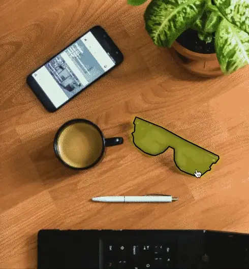

# SVG-MAP

Build _enhanced_, clickable, animate-able image maps using SVG shapes (polygon,
rect, circle). This tool converts HTML image maps (generally I make these in
GIMP, which outputs a .map file) to SVG shapes and accurately overlays them on
an image.

## Why?

An [image map](https://developer.mozilla.org/en-US/docs/Web/HTML/Element/map) is
a fun (although dated) tool for making an image interactive, but there are
limitations. Namely:

1. `<area>` elements don't respond to many (any?) CSS styles (such as `:hover`)
   so it can be hard to find, or differentiate between, regions.
1. Regions are based on coordinates relative to the image size, so they are not
   responsive.

SVGs don't have those limitations. We can use CSS and other powerful SVG tools
to style regions, and we can scale them along with the image.

## Installation and Usage

I'm new to [poetry](https://python-poetry.org/docs/), so I'm trying it out here.
The only dependency is BeautifulSoup4, so as an alternative you can install
that, skip poetry, and run map-to-svg.py normally.

1. Install [poetry](https://python-poetry.org/docs/#installation).
1. Clone this repo.
1. `poetry install`
1. `poetry run python map-to-svg.py <path/to/.map/or/.html>`

## TODO/Limitations

- The native image size needs to be known beforehand (that is, `<image>` must
  have `height` and `width` attributes) in order to overlay the SVG properly.
- Not all `<area>` attributes are accounted for (e.g. `target`).
- Some of the style for regions is currently baked in.
- Some styles are inlined. Maybe output a separate stylesheet?
- The `default` area shape isn't properly supported.
- Tests.
